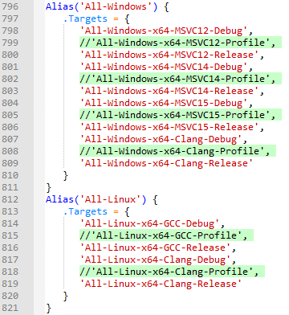
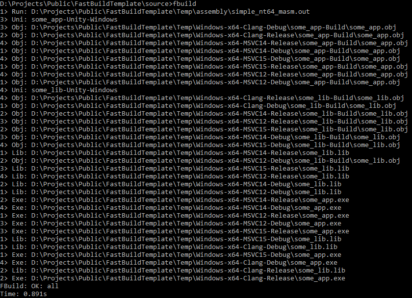
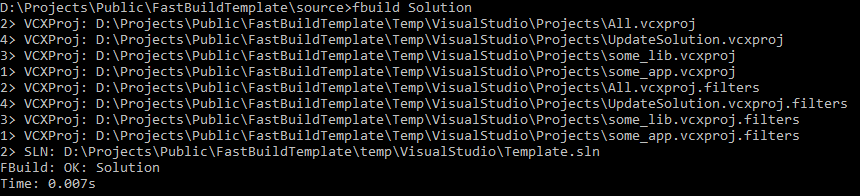
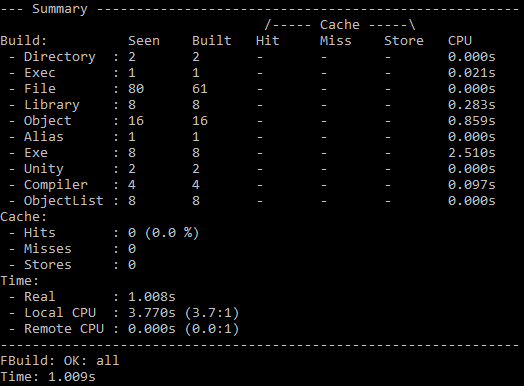
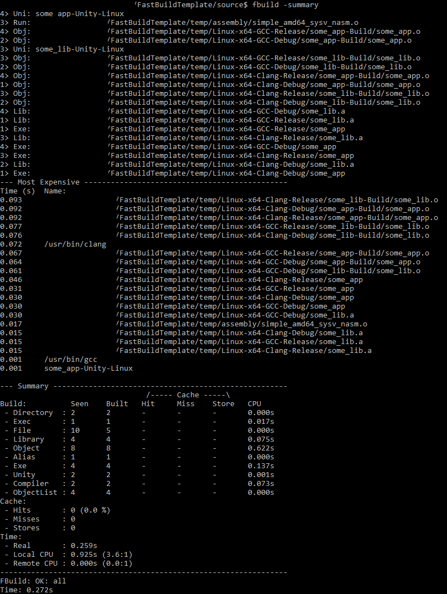

# FastBuildTemplate
Example on how to use fastbuild for building projects with various compilers, sdk's, and external tools. Currently I've included setup for Visual Studio 2013-17, Clang and GCC. I show how to use fastbuild to build ASM and C files into static library and executable.

### Usage:
 1. Download and install selected compilers and [fastbuild](http://fastbuild.org).
 2. Copy necessary compiler files to seleted folders. See files_needed_in_external_folder.lst file located in ./external folder for list of files needed. This step will be replaced by scripts in the future.
 3. Set PATH to include fastbuild folder in external tools.
 4. Enable or disable specific builds/compilers in fbuild.bff file if You didn't prepare them or don't want them:

 5. Open shell prompt and type fbuild while being inside source dir.

Examples were tested on the following compilers:

Platform | Arch | Compiler                                            | Notes
---------|------|-----------------------------------------------------|-------
Windows  | x64  | Clang 5.0.0 Pre-release                             | downloaded from [llvm builds](https://llvm.org/builds/) - to be exact it was [LLVM-5.0.0-r306282-win64.exe](http://prereleases.llvm.org/win-snapshots/LLVM-5.0.0-r306282-win64.exe) version,
Windows  | x64  | MSVC12.4 (Visual Studio 2013, platform toolset 120) | downloaded from [here](http://go.microsoft.com/fwlink/?linkid=530250)
Windows  | x64  | MSVC14.2 (Visual Studio 2015, platform toolset 140) | downloaded from [here](https://www.visualstudio.com/en/vs/older-downloads/)
Windows  | x64  | MSVC15.2 (Visual Studio 2017, platform toolset 141) | downloaded from [here](https://www.visualstudio.com/en/thank-you-downloading-visual-studio/?sku=Community&rel=15#)
Windows  | x64  | MASM                                                | Included in MSVC15.2.
Linux    | x64  | Clang 4.0.0 (on a musl libc based custom Linux)     | Distro provided or Your own build
Linux    | x64  | GCC 6.4.0 (on a musl libc based custom Linux)       | Distro provided or Your own build
Linux    | x64  | NASM 2.13.01                                        | Distro provided or Your own build

With following SDK's:
- Windows SDK 10 (10.0.15063.0) - used with MSVC 14.2 and 15.2,
- Windows SDK 8.1 - used with MSVC12.4.

As a side note - all tests were done on community editions of Visual Studio, so that it can be used by everyone.

### Screens

- Windows build:

- Windows solution generation:

- Windows build summary:

- Linux build with summary (removed path/username/hostname)

### FAQ

- **Why have compilers/tools inside the same repo with code and assets?** Its simpler that way. You just have to clone one repo and You can simply type 'fbuild' and have everything compiled, assets ready. No installations needed. For debugging You can use either gdb on Linux or have one version of VS installed and use that. It's also amazing for build systems/farms, where after setting up VMs, or some OS container You can simply clone repo and build, or schedule builds and stats collection. I do this for apps build, content build, automated perf tests (both CPU perf tests and GPU tests; by GPU I mean not only running some executable after build and collecting frame/ms etc, but also executing some tools like Radeon GPU Analyzer and collecting data for compiled shaders). The process is easy, repeatable and can be automated.
- **Why did You only copy minimal number of files for each compiler / sdk on Windows?** This was done to just show the most minimal usage with what is available after You install MSVC/WinSDK out of the box. In my private projects I don't really use most of the stuff provided either. I've custom CRT and I only depend on kernel wherever I can, not only on Windows, but also AIX, BSD, Linux, Solaris.

### Future

- on windows 'prepare_compilers.bat' script to copy only required compiler/include/libraries files from default installations),
- on linux 'prepare_compilers.sh' script to setup chroot's/docker's for different compiler/libc combos,
- add shared library creation sample (dll, so),
- show how You can use fastbuild for other types of files (to compile hlsl/glsl or texture conversions from tiff to ktx/dds/proprietary, etc),
